<p align="center">
  
</p>

<h1 align="center">VIBE STUDIO</h1>

<p align="center">
  
  
  
</p>

<p align="center">
  <b>바이브코딩 기초반과 전문 과정을 함께 운영하는 Electron 기반 강의 스튜디오</b><br>
  현재 2기 6주 운영본과 V3 커리큘럼을 동시에 관리합니다.
</p>

<hr/>

## 앱 화면

<p align="center">
  
</p>

<p align="center"><i>VIBE STUDIO 3단 레이아웃 — 왼쪽 과정·일정, 가운데 강의·자료실, 오른쪽 목표·실행</i></p>

앱은 전체 과정 카탈로그 대신 **3단 구조**로 시작합니다.

- **왼쪽**: 과정, 일정, 설정
- **가운데**: 선택 과정의 강의, 강사자료실, 수강생 출력물, 실습파일, 공식자료 학습실
- **오른쪽**: 목표, 준비물, 결과물과 실행 버튼

`Ctrl+K`로 과정·회차·강사자료·수강생 출력물·실습 파일·공식자료를 빠르게 검색할 수 있습니다.

<hr/>

## 📚 과정 카탈로그

| 트랙 | 주차 | 설명 | 슬라이드 |
|---|---|---|---|
| **바이브코딩 기초반 2기** | 6주 | AI 코딩 입문, 실시간 프로젝트 기반 | 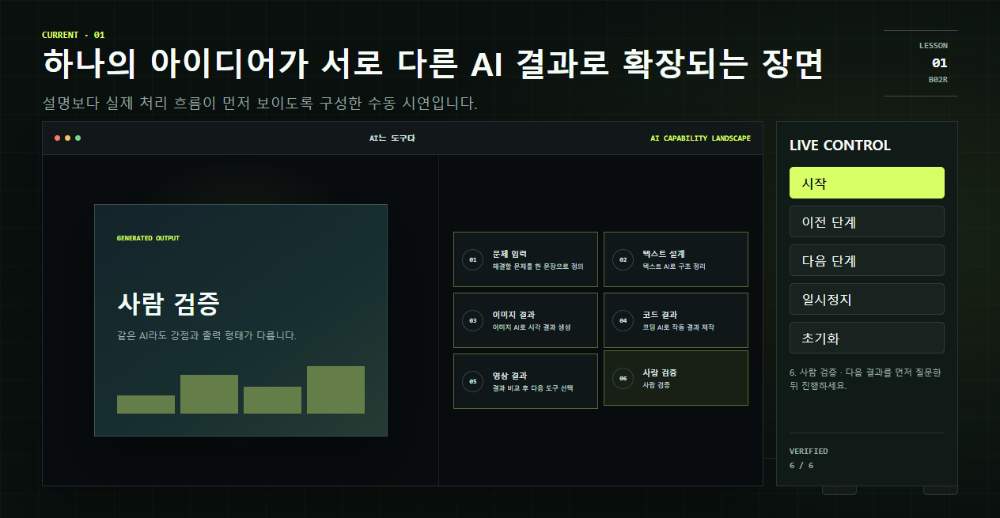 |
| **AI 제품·수익화** | 8주 | SaaS 개발부터 외주 납품까지 | 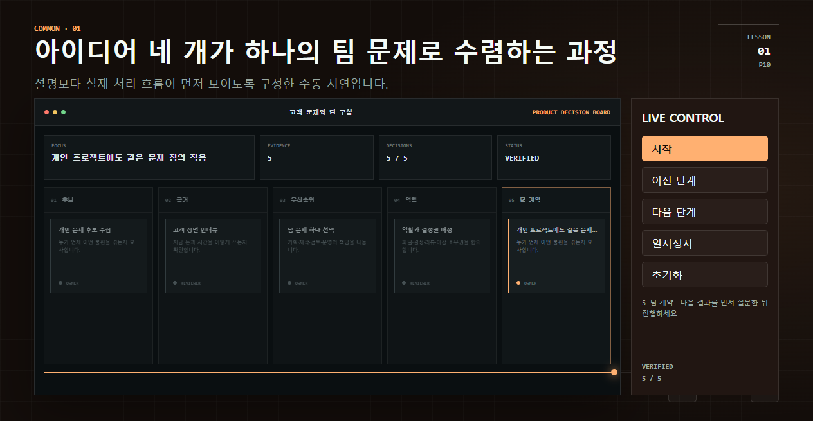 |
| **AI Workflow Architect** | 4주 | 터미널·Git·MCP·Agent 워크플로 설계 | 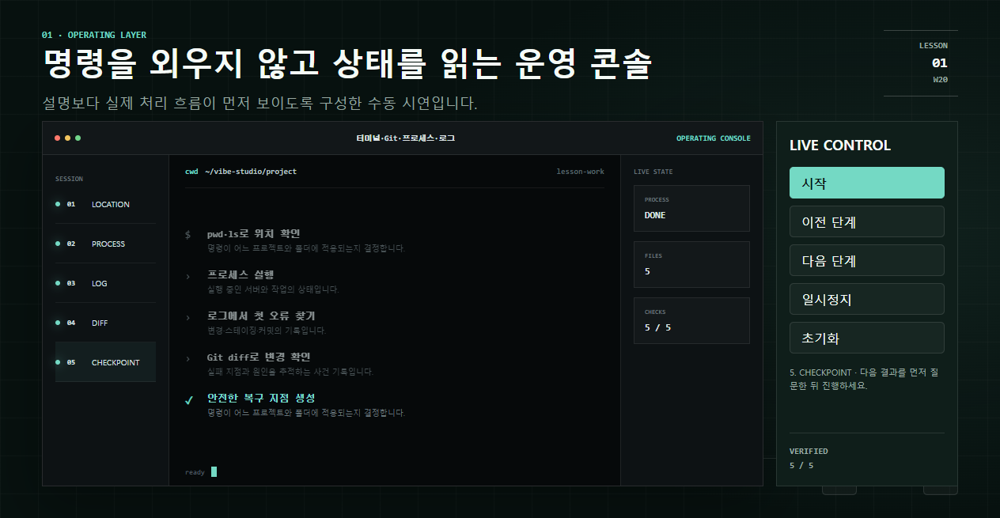 |
| **Claude Code Professional** | 6주 | Claude Code 도구 전반의 프로젝트 자동화 | 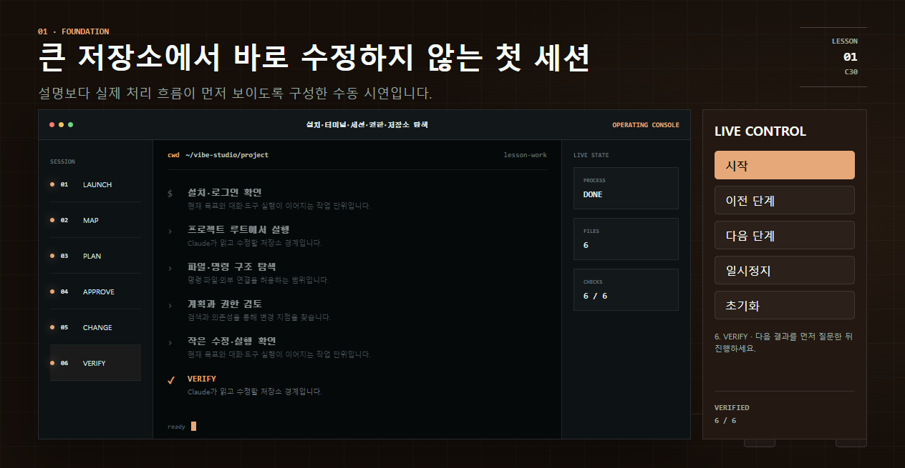 |
| **Codex Professional** | 6주 | Codex 워크스페이스와 Worktrees 활용 | 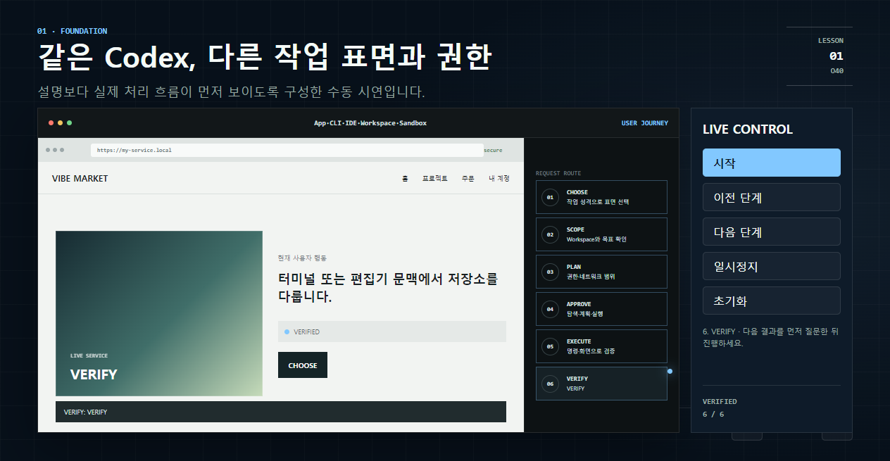 |
| **AI 심화 통합과정 (V3 pilot)** | 8주 | 고급 Agent 팀과 워크플로 자동화 | 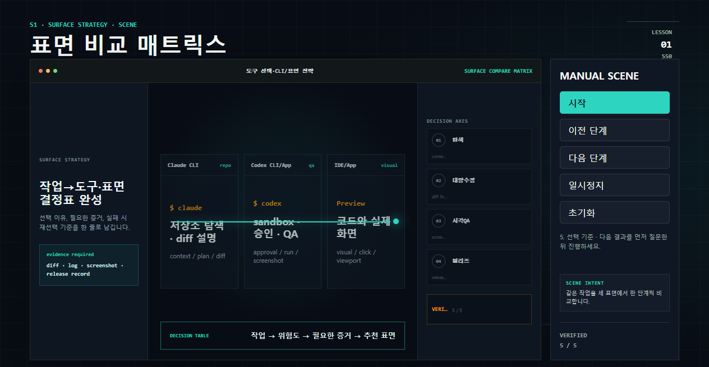 |
| **AI 한방 이해하기** | 4주 | AI 개념과 실습을 한 번에 | 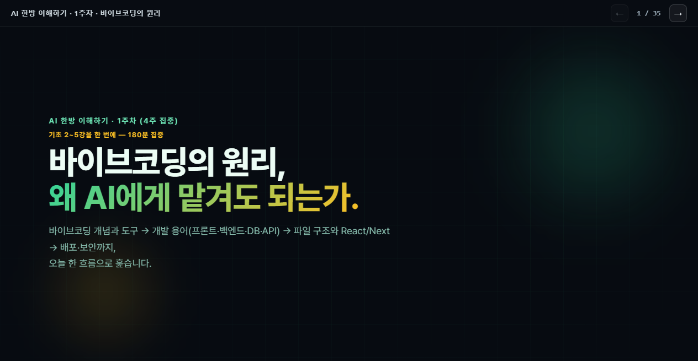 |
| **특강 라이브러리** | 60~90분 | AI 엔지니어링의 진화, AI 안전 운전 | 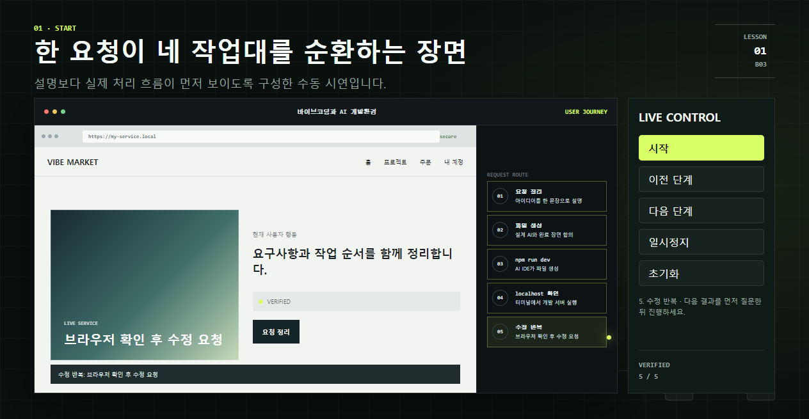 |

**권장 학습 순서**: `기초 → Workflow Architect → Claude Code 또는 Codex`

`AI 제품·수익화`는 기초 수료 후 선택하는 별도 사업 트랙입니다.

<hr/>

## 🚀 시작하기

### 개발 환경 실행

```bash
npm install
npm start
```

### V3 콘텐츠 생성

```bash
npm run build:v3
```

`scripts/build-v3-content.js`와 `scripts/build-v3-labs.js`가 다음 파일을 동기화합니다.

- `src/content/course-manifest.json`
- `src/content/v3/course-data.js`
- `src/content/v3/projects/*`의 34개 실행형 실습 패키지
- `docs/v3/basic-v2-freeze.json`

현재 2기 활성 강의인 `src/content/sessions/*`는 생성 대상이 아니며 해시로 보호됩니다. 개편 작업본은 V3 덱으로 별도 생성됩니다.

### 오프라인 대체 화면 생성

```bash
npm run capture:v3-fallbacks
```

<hr/>

## 🔎 공식 참고자료 갱신

```bash
npm run sources:refresh
```

GitHub, Vercel, Firebase, MCP, Claude Code, Codex 등의 공식 URL만 확인합니다. 원문을 복제하지 않고 상태, 확인 날짜, 쉬운 한국어 설명, 강사용 배경, 쉬운 비유, 오해, 시연 포인트와 수업 전 체크리스트를 저장합니다.

<hr/>

## 🧪 품질 검사

```bash
npm run audit:curriculum
npm run check
npm run smoke:app
npm run smoke:tracks
npm run qa:print
```

| 명령 | 설명 |
|---|---|
| `audit:curriculum` | 34개 개편 회차의 고유 scene id, 수동 제어, 대본, 실습 패키지, 대체 화면과 V2 활성 파일 검사 |
| `check` | JavaScript 문법, 매니페스트와 파일 연결, 기존 슬라이드 카운터 검사 |
| `smoke:app` | 단일 강사용 3단 UI, 5개 탭, 전역 강사자료실, 공식자료 학습실, 플레이어, `Ctrl+K` 검사 |
| `smoke:tracks` | 현재 2기 작업본을 포함한 34개 회차의 13장 덱과 수동 진행 제어 전수 검사 |
| `qa:print` | 71개 수강생·강사용 A4 PDF의 페이지 수, 밝은 배경과 가로 넘침 검사 |

<hr/>

## 📦 Windows Beta EXE

```bash
npm run release:v3-beta
```

`release/`에 portable EXE, 현장 실행 가이드, 강의 전 체크리스트와 미리보기 이미지가 생성됩니다.

<hr/>

## 📄 주요 문서

| 문서 | 설명 |
|---|---|
| [`docs/v3/CURRICULUM-V3.md`](docs/v3/CURRICULUM-V3.md) | V3 커리큘럼 운영 원칙과 과정 안내 |
| [`docs/v3/CURRICULUM-MATRIX.md`](docs/v3/CURRICULUM-MATRIX.md) | 과정별 주제 중복 방지 매트릭스 |
| [`docs/v3/ARCHITECTURE.md`](docs/v3/ARCHITECTURE.md) | V3 콘텐츠 경계와 인터랙션 구조 |
| [`docs/v3/QA-CHECKLIST.md`](docs/v3/QA-CHECKLIST.md) | 수강생·강사용 자료 검증 체크리스트 |
| [`docs/v3/SOURCES-WORKFLOW.md`](docs/v3/SOURCES-WORKFLOW.md) | 공식 참고자료 갱신 워크플로 |
| [`docs/CURRICULUM.md`](docs/CURRICULUM.md) | 기존 2기 운영 커리큘럼 보존본 |
| [`docs/V3_BETA_RELEASE_REPORT.md`](docs/V3_BETA_RELEASE_REPORT.md) | V3 베타 릴리즈 보고서 |
| [`docs/V2_RELEASE_REPORT.md`](docs/V2_RELEASE_REPORT.md) | V2 완료 보고서 |

<hr/>

## 💻 개발 기술

| 구분 | 기술 |
|---|---|
| 프레임워크 | Electron 31 |
| 번들러 | electron-builder |
| 빌드 | esbuild, node 스크립트 |
| 인터랙티브 엔진 | HTML + CSS transform/opacity (GPU 부담 최소화) |
| 실습 패키지 | starter · broken · complete 3단계 제공 |
| 자료 출력 | A4 PDF 71종 자동 QA |

<hr/>

<p align="center">
  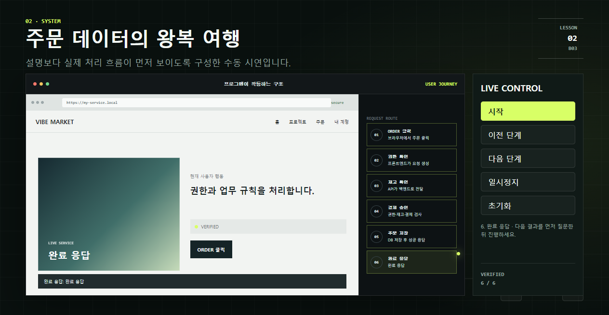
  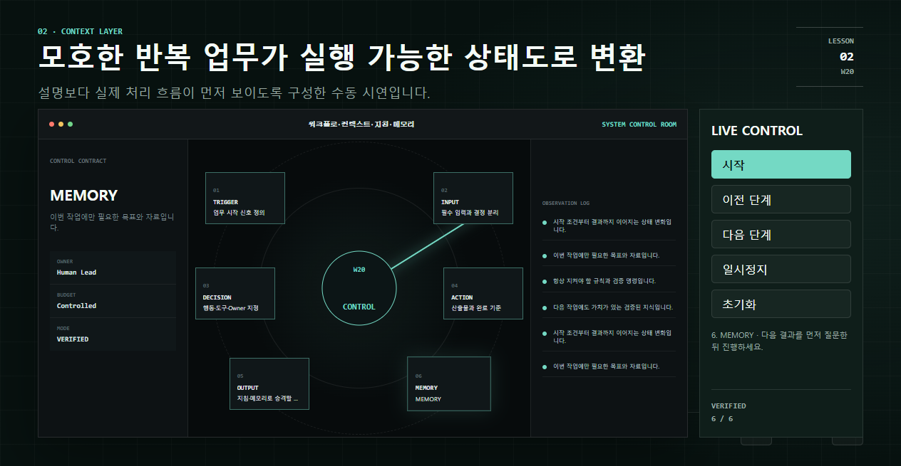
  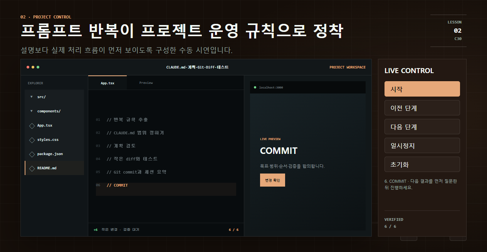
  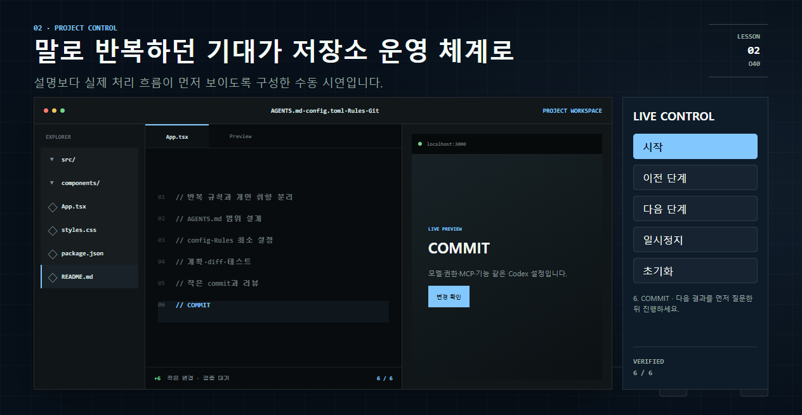
</p>

<p align="center"><i>각 과정의 인터랙티브 슬라이드 — 강사가 시작·다음·일시정지·초기화로 제어</i></p>

---

<p align="center">Made by <a href="https://github.com/ju0o">ju0o</a> · <a href="https://github.com/ju0o/Vibecoding-Basic-app">GitHub</a></p>
